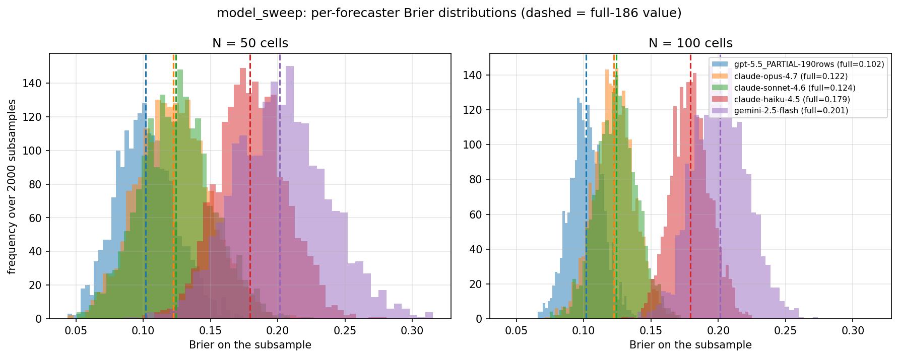
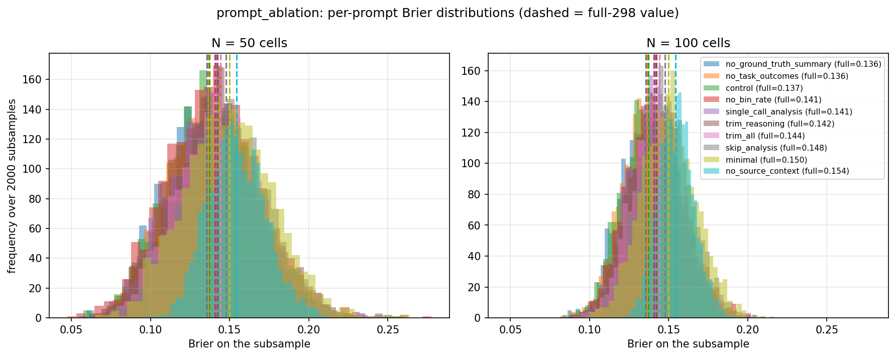

# Subsample recovery — do smaller-N Briers preserve our conclusions?

Reference = full-N Brier on the committed `forecasting_results/` data. For each N we draw 2000 stratified subsamples and check whether the experiment's headline (its best condition + overall ranking) survives. $0 — no new API calls.

## model_sweep — claim: *GPT-5.5 is the best forecaster*

- 5 forecasters · matched cells: **186** · full-N winner: **`gpt-5.5_PARTIAL-190rows`** (Brier 0.1019)
- full-N ranking (best->worst): `gpt-5.5_PARTIAL-190rows` 0.102, `claude-opus-4.7` 0.122, `claude-sonnet-4.6` 0.124, `claude-haiku-4.5` 0.179, `gemini-2.5-flash` 0.201

| N (cells) | P(full-N winner still #1) | mean Spearman (full ranking) |
|---|---|---|
| 30 | 74% | 0.849 |
| 50 | 85% | 0.907 |
| 75 | 94% | 0.941 |
| 100 | 98% | 0.958 |
| 150 | 100% | 0.978 |

## prompt_ablation — claim: *the full/least-ablated prompt ranks best*

- 10 prompts · matched cells: **298** · full-N winner: **`no_ground_truth_summary`** (Brier 0.1358)
- full-N ranking (best->worst): `no_ground_truth_summary` 0.136, `no_task_outcomes` 0.136, `control` 0.137, `no_bin_rate` 0.141, `single_call_analysis` 0.141, `trim_reasoning` 0.142, `trim_all` 0.144, `skip_analysis` 0.148, `minimal` 0.150, `no_source_context` 0.154

| N (cells) | P(full-N winner still #1) | mean Spearman (full ranking) |
|---|---|---|
| 30 | 16% | 0.436 |
| 50 | 21% | 0.541 |
| 75 | 24% | 0.642 |
| 100 | 28% | 0.723 |
| 150 | 36% | 0.831 |
| 200 | 42% | 0.907 |
| 250 | 52% | 0.954 |

## Reading it

- **P(full-N winner still #1)** = how often the subsample agrees on the single best condition. This is the "is GPT-5.5 still best?" number.
- **mean Spearman** = how well the whole ordering is preserved (1.0 = identical).
- In the histograms, a condition is *reliably distinguishable* at a given N only when its Brier distribution barely overlaps its neighbours'. Conditions whose true Briers are within ~0.005 (e.g. Opus vs Sonnet) overlap heavily and cannot be separated at small N — but the clear winner/loser still separate.

