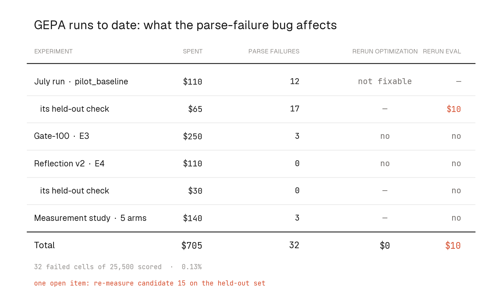

# Parse-failure audit: which experiments are affected, which need re-running

**The bug.** When the forecaster's answer does not contain a parseable
`<p50>`, the pipeline scores that cell **Brier 1.0** — the worst possible
value — instead of retrying or scoring it neutrally. A typical cell scores
~0.10, so one failure costs about **nine ordinary cells**. Impact of a single
failure on a mean: **20-cell gate batch +0.045**, **84-cell val pass +0.011**,
**230-cell held-out pass +0.004**. Our real prompt effects are ~0.02, so a
handful of failures can erase or invent a result.

Failures are logged explicitly (sentinel score −1.0), so their effect on any
**score** can be recomputed exactly with **no new API calls**. Reproduce every
number below with:

```bash
uv run python scripts/parse_failure_audit.py     # in the gepa repo
```

**What can and cannot be recovered**

| | Recoverable from logs? |
|---|---|
| Any **score** (val, held-out, gate batch) | **Yes, exactly** — recompute with failures dropped |
| Which **decisions** a failure could have flipped | **Yes** — compare the accept/reject margin against the ~0.9 penalty |
| The **trajectory** after a flipped decision | **No.** GEPA is sequential: a flipped accept changes the pool, hence parent selection, hence every later iteration. Re-running does not recover it either — at temperature 1.0 a re-run is a different sample, so it cannot isolate the fix from run-to-run variance |

**Validation that "parsed-only" recomputation is trustworthy:** for cands 12
and 20, the parsed-only estimate from the temp-1 held-out data
(+0.0267/+0.0268 and +0.0151/+0.0173) matched their later temp-0 *measured*
edges (+0.0262 and +0.0172) to within ~0.001. Recomputation and
re-measurement agree.

---

## State of every run



`not fixable` on the July run means a re-run cannot correct it: at temperature
1.0 a re-run is a different sample, so it cannot separate the fix from
run-to-run variance. Its three flipped rejections (iters 5, 11, 21) stay a
documented caveat; its outputs (cands 12, 15, 20) are validated by
re-measurement instead.

## The single most consequential failure

**The seed prompt failed one val cell in the July run**, inflating its val
Brier from **0.1038 → 0.1144**. The five top candidates had **zero** val
failures, so every "improvement over the seed on val" is overstated by
exactly **+0.0107**:

| Candidate | val edge as first reported | val edge, corrected |
|---|---|---|
| 12 | +0.0207 | **+0.0100** |
| 14 | +0.0181 | +0.0074 |
| 20 | +0.0130 | +0.0023 |
| 9 | +0.0112 | +0.0005 |
| 15 | +0.0107 | +0.0001 |

So the widely-quoted July headline **"val 0.114 → 0.094 (+0.021)"** is really
**"0.104 → 0.094 (+0.010)"**. Independent confirmation: the seed's five clean
re-measurements average **0.1036**, matching the parsed value.

This is a **reporting** correction, not a re-run: no decision inside the run
depended on the seed's aggregate val score (parent selection uses per-cell
Pareto standings, where the single failed cell costs the seed exactly one
cell).

## Standing fix

Retry once on parse failure (or score unparseable cells at chance, 0.25,
instead of 1.0) before any further runs — otherwise every future experiment,
including replicate runs, inherits the same bias: the short seed prompt
essentially never fails (~1 in 1,400 cells) while longer evolved prompts fail
~1%, so the penalty lands almost entirely on the candidate side of every
comparison.
