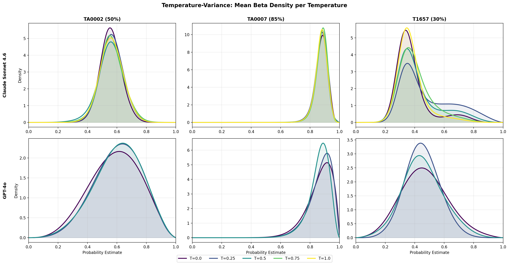
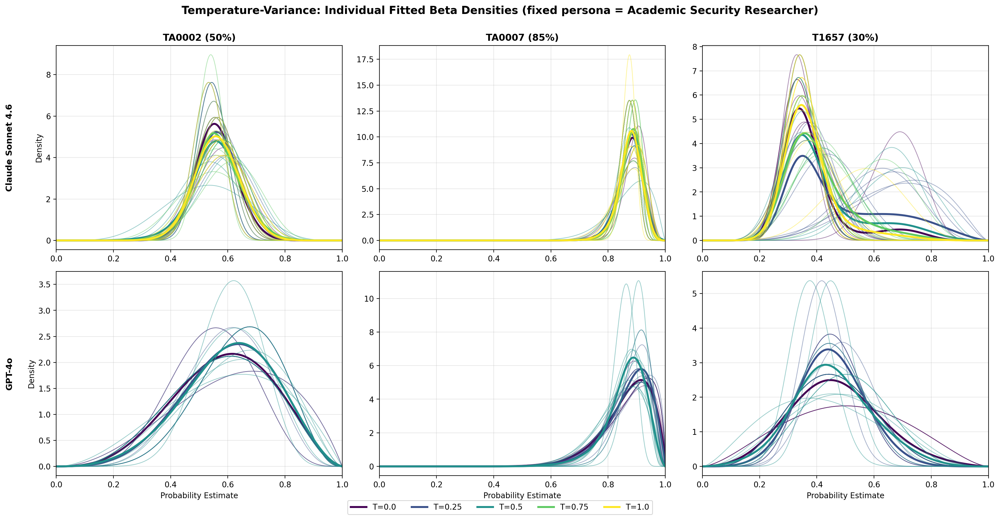

# Does sampling temperature change the elicited belief distribution?

## Question
Holding everything else constant (single persona = *Academic Security Researcher*,
fixed prompt, fixed scenario step, fixed task), does varying the LLM's sampling
**temperature** produce statistically different belief distributions over the
probability of capability uplift?

## Method (in one paragraph)
For each `(model, scenario step, temperature)` cell we run **10 independent
elicitations**. Each elicitation returns three percentiles `(p25, p50, p75)`
of the expert's belief about the uplift probability. We fit a **Beta(α, β)** on
`[0, 1]` to each triple, treat the resulting CDF as a point in Wasserstein-2
space, and run a **Fréchet ANOVA** (group = temperature) using the existing
`frechet_anova_*` machinery. The test statistic compares between-group
Wasserstein dispersion to within-group dispersion; p-values come from a
5,000-permutation test. `ICC_F` reports the share of total Fréchet variance
attributable to temperature.

- **Claude Sonnet 4.6:** T ∈ {0.0, 0.25, 0.5, 0.75, 1.0}
- **GPT-4o:** T ∈ {0.0, 0.5, 1.0, 1.5, 2.0}
- **Steps:** TA0002 (50% baseline), TA0007 (85% baseline), T1657 (30% baseline)
- 30 cells × 10 runs = **300 elicitations**

## Results

| Model | Step | k (temps used) | T_n | p (perm) | ICC_F |
|---|---|---|---|---|---|
| Claude | TA0002 (50%) | 5 | 0.0016 | 0.77 | 0.05 |
| Claude | TA0007 (85%) | 5 | 0.0002 | 0.98 | 0.02 |
| Claude | T1657 (30%) | 5 | 0.0794 | 0.20 | 0.12 |
| GPT-4o | TA0002 (50%) | 3* | 0.0029 | 0.39 | 0.08 |
| GPT-4o | TA0007 (85%) | 3* | 0.0027 | **0.03** | 0.19 |
| GPT-4o | T1657 (30%) | 3* | 0.0085 | 0.08 | 0.15 |

*GPT-4o at **T = 1.5 and T = 2.0** produced **100% probability-parsing failures**
(60/60 runs unparseable), so those temperatures were dropped and ANOVA used the
3 lower temps. This is itself a notable finding: above T ≈ 1.0, GPT-4o stops
producing valid structured percentiles.

### Mean Beta density per temperature (each cell = one (model, step))

### All 10 individual fitted Betas per temperature

## Conclusion

**Temperature has essentially no meaningful effect on elicited belief
distributions in the regimes the parser tolerates.**

- For **Claude**, all three steps are non-significant (p = 0.20–0.98) and
  ICC_F ≤ 12% — the curves at T = 0.0 and T = 1.0 are nearly indistinguishable
  in the mean-density plot.
- For **GPT-4o**, the only marginally significant result is TA0007
  (p ≈ 0.03, ICC_F = 19%); the effect size is small and the high-temperature
  samples (T ≥ 1.5) are unusable.
- For context, the same Fréchet-ANOVA pipeline gives **persona ICC_F ≈ 6–25%**
  and **cross-model ICC_F ≈ 48–69%**. So **temperature variance ≲ persona
  variance ≪ cross-model variance**.

**Practical takeaway:** when designing the elicitation protocol, temperature
choice within `[0, 1]` is a second-order knob — variability across runs at a
*single* temperature is comparable to variability across temperatures. The
dominant sources of variance are persona and (especially) the underlying model.

## Files
- `frechet_anova_temperature.py` — analysis script
- `plot_beta_distributions_temperature.py` — figure generation
- `frechet_anova_results_temperature.txt` — raw ANOVA output
- `beta_temperature_means_grid.png`, `beta_temperature_individual_grid.png` — figures
- Raw runs: `output_data/experiments/temperature_{provider}_{step}_t{T}/run_*/`
